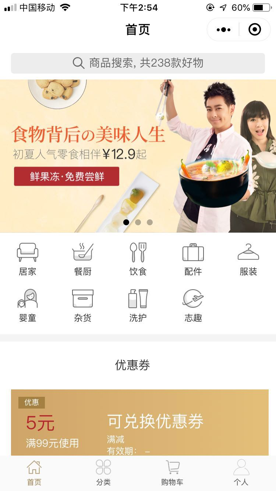
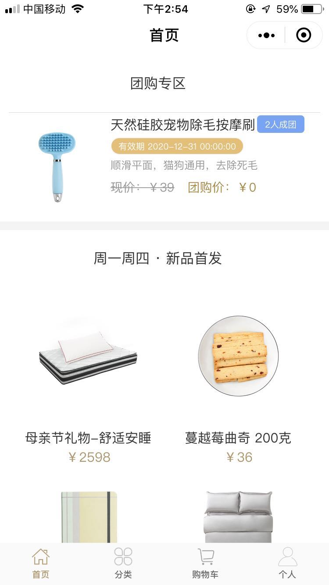
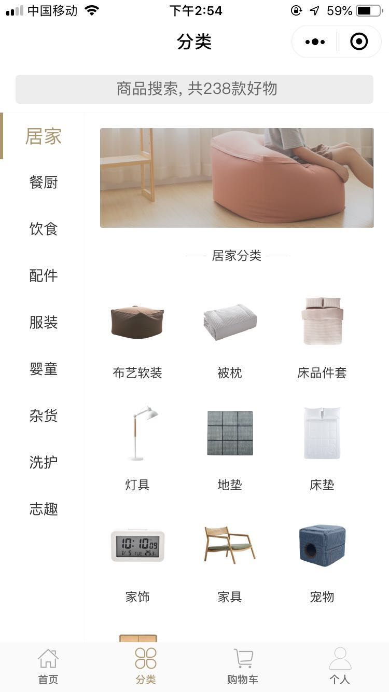
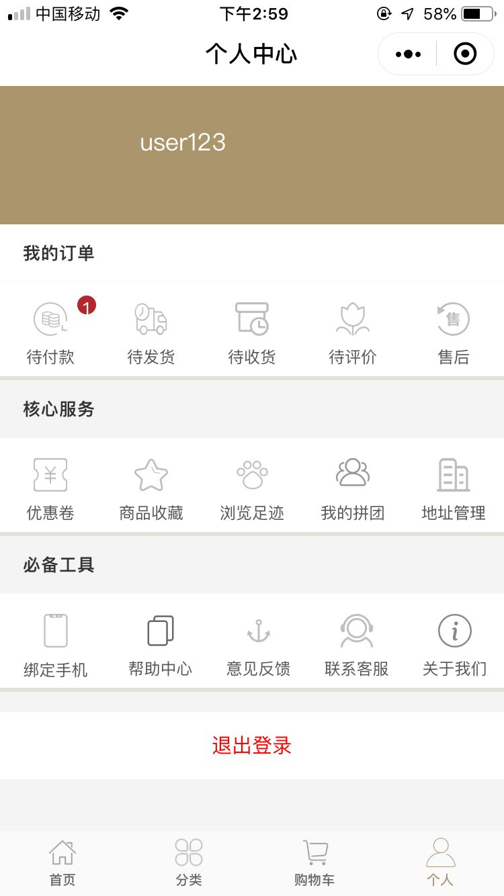
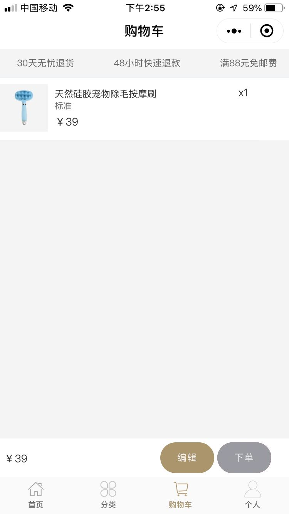
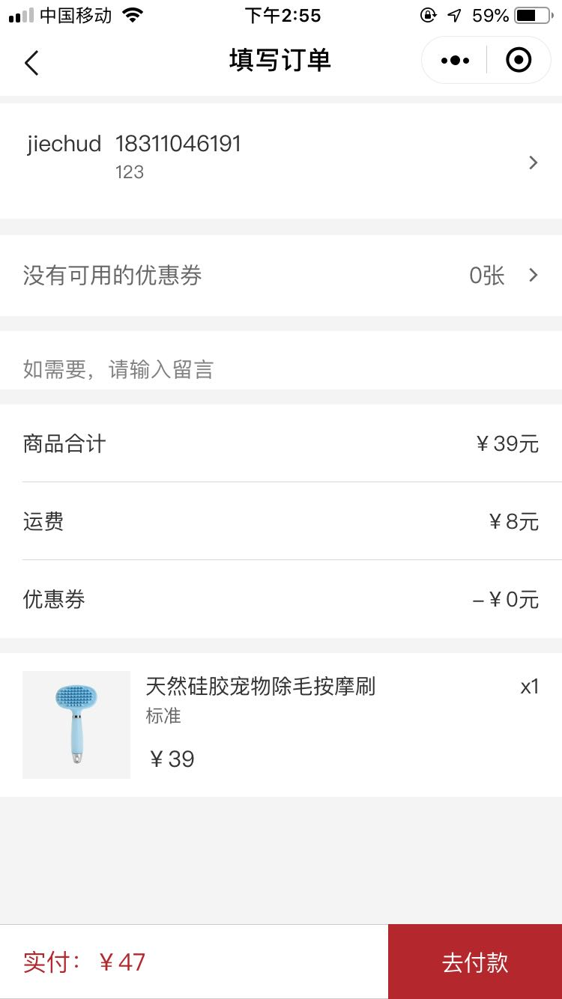

小程序
------------
Taro_Mall是一款多端开源在线商城应用程序，后台是基于litemall基础上进行开发，前端采用Taro框架编写，现已全部完成微信小程序，头条小程序，和h5移动端，后续会对APP，淘宝，百度小程序进行适配。Taro_Mall已经完成了 litemall 前端的所有功能

扫码体验
------------
感谢 @程哥提供的认证的小程序平台,微信登录和支付现在已经可以用。(请先不要支付，暂不支持退款，如果想要测试，请选择1分钱的商品)

小程序正式版

小程序(体验版，可以体验最新的功能)

h5

后台系统地址

https://shop.xinmeitop.com/boss

快速启动
------------

#### 微信小程序
* `git clone https://github.com/jiechud/taro-mall.git`
* `npm install || yarn install`
* `yarn dev:weapp` 启动服务
*  用微信开发者工具打开dist目录

#### 头条小程序
* `yarn dev:tt`
* 头条小程序开发工具打开dist目录

#### h5
* `yarn dev:h5` 启动服务
* 打开浏览器

系列文章
--------
* [01 Taro_Mall 开源多端小程序框架设计](https://www.cnblogs.com/qiaojie/p/12431670.html)

功能
------------
* 首页
* 专题列表、专题详情
* 分类列表、分类详情
* 品牌列表、品牌详情
* 新品首发、人气推荐
* 优惠券列表、优惠券选择
* 商品搜索
* 商品详情
* 购物车
* 购物下单
* 订单列表、订单详情
* 地址、收藏、足迹、意见反馈

项目截图
------------------
  

  

  

项目架构
------------
项目用Taro做跨端开发框架，Taro基本采用React的写法，项目集成了 redux dva 控制单向数据流，用immer来提供不可变数据，提升整体的性能，减少渲染。

技术栈
|  技术   | 说明  | 官网  |
|  ----  | ----  |  ---- |
| Taro  | 多端统一开发解决方 |  https://taro.aotu.io/      |
| TaroUI  | 一套基于 Taro 框架开发的多端 UI 组件库 |  https://taro-ui.jd.com/    |
| redux| 单项数据流   | https://redux.js.org/  |
| dva |  基于 redux 和 redux-saga 的数据流方案 |  https://dvajs.com/ |
| immer | 创建不可变数据 |  https://immerjs.github.io/immer/docs/introduction |

FAQ
-----------
1. 账号登录的用户名密码是什么？

account: user123   password: user123

联系我
--------------
建立了一个微信交流群，如需加入，请添加微信，备注小程序

微信: 

赞赏
-----------
因服务器是由个人维护，如果这个项目对您有帮助，您可以扫描下面二维码进行捐赠，谢谢。

License
------------
MIT License  Copyright (c) 2020 jiechud
